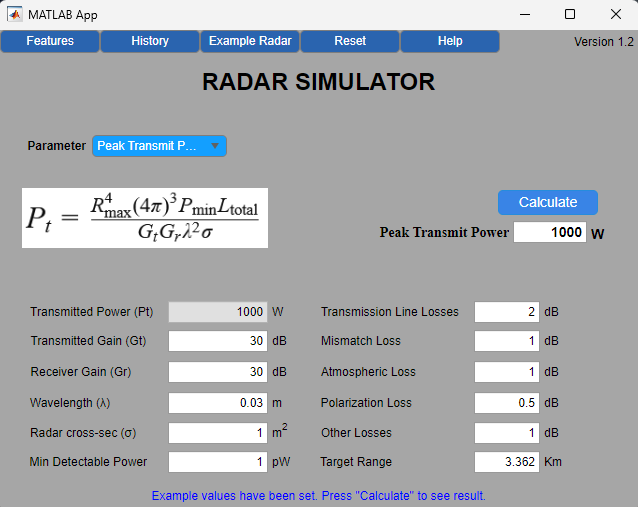
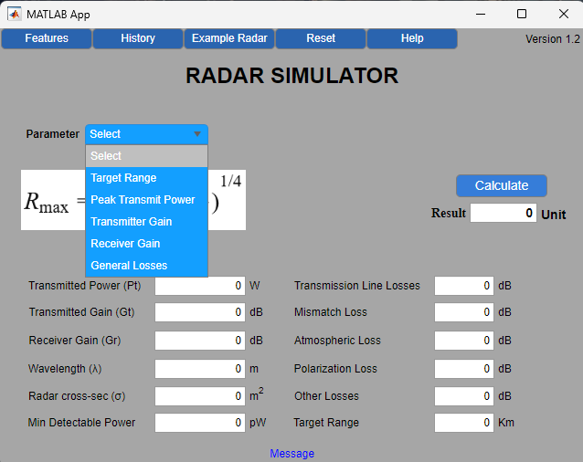
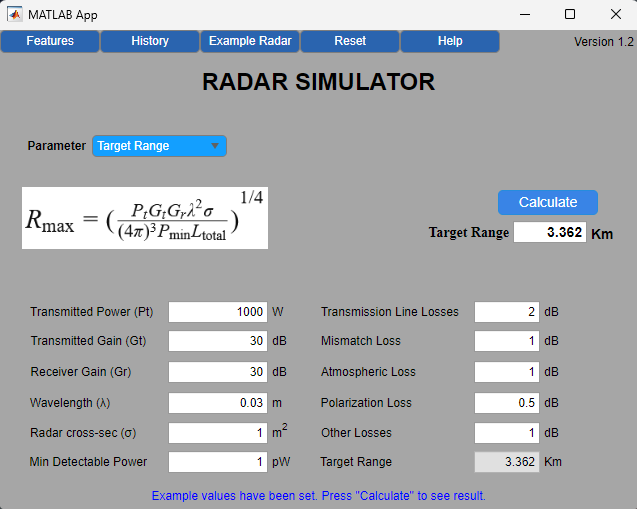

# RADAR Simulator in MATLAB

## Objective
To provide an interactive platform for simulating radar performance and enable users to calculate radar range based on input parameters. Users can also visualize the impact of different parameters on various radar parameters such as Target Range, Transmitted Power, Transmitter Gain, Receiver Gain, and Losses.



## Features
The Radar Simulator includes the following features:
1. **Parameter Input Fields**: Users can input various radar parameters such as Transmitted Power (Pt), Transmitted Gain (Gt), Receiver Gain (Gr), Wavelength (λ), Radar Cross Section (σ), and Minimum Detectable Power.
2. **Calculation Capabilities**: The application can calculate radar range, peak transmit power, total losses, transmitter gain, and receiver gain based on user inputs.
3. **Reset Functionality**: A reset button allows users to clear all input fields and start a new simulation.
4. **History Feature**: The simulator stores the last used values for reference and comparison.
5. **Help and Information**: The application includes buttons for features and history, providing additional information and user guidance.

## User Interface
The user interface of the Radar Simulator is designed for simplicity and ease of use. It includes:
- **Input Fields**: For entering values of radar parameters.
- **Dropdown Menu**: To select the parameter to calculate.
- **Buttons**: For calculating results, resetting values, viewing history, and accessing help information.
- **Message Label**: Displays messages and results to the user.





## Getting Started
To get started with the RADAR Simulator, follow these steps:
1. Clone the repository to your local machine.
   ```bash
   git clone https://github.com/TaruntheBee/radar-simulator.git
## Usage
-Input the required radar parameters in the provided fields.
-Select the parameter to calculate from the dropdown menu.
-Click the calculate button to view the results.
-Use the reset button to clear inputs and start a new simulation.
-Refer to the history for past inputs and results.

## Contributing

Contributions are welcome! Please fork the repository and submit a pull request with your changes.
## License

This project is licensed under the MIT License - see the LICENSE file for details.
